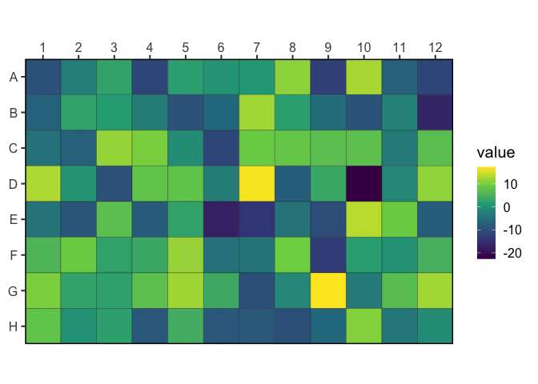

<!-- README.md is generated from README.Rmd. Please edit that file -->

# wellr

<!-- badges: start -->

[](https://CRAN.R-project.org/package=wellr)
[](https://github.com/bradyajohnston/wellr/actions)
[](https://app.codecov.io/gh/bradyajohnston/wellr?branch=master)
[](https://github.com/BradyAJohnston/wellr/actions/workflows/R-CMD-check.yaml)
<!-- badges: end -->

`{wellr}` provides a consistent and reliable interface for dealing with
plate-based data and related calculations. It provides functions for
reading the output of various plate readers, indexing through and
reformatting microtitre plates, converting between well IDs (“C05”) and
their respective rows, columns and index.

## Installation

<!-- You can install the released version of wellr from [CRAN](https://CRAN.R-project.org) with: -->

### From R-Universe:

This is the recommended way to install the package - as it requires no
additional dependencies. It is currently not available on CRAN.

``` r
install.packages("wellr", repos = "bradyajohnston.r-universe.dev")
```

### From GitHub

``` r
# install.packages("remotes")
remotes::install_github("bradyajohnston/wellr")
```

## Basic Examples

``` r
library(wellr)

well_format("G8")
#> [1] "G08"
well_to_col_num("G8")
#> [1] 8
well_to_row_num("G8")
#> [1] 7
well_to_index("H1")
#> [1] 85
well_to_index("H1", colwise = TRUE)
#> [1] 8
well_from_index(37)
#> [1] "D01"
well_from_index(37, colwise = TRUE)
#> [1] "E05"
well_join(3, 8)
#> [1] "C08"
well_join("E", 10)
#> [1] "E10"
```

## Reading Biotek

Get the file paths of the demo files.

``` r
file_data <- system.file("extdata",
  "20220929_1steptimer20.csv",
  package = "wellr"
)

file_meta <- system.file("extdata",
  "20220929_1steptimer20_metainfo.csv",
  package = "wellr"
)
```

Read in an example plate from a Biotek plate reader.

``` r
plate <- plate_read_biotek(file_data)
plate
#> # A tibble: 19,200 × 4
#>     time well    lum od600
#>    <dbl> <chr> <dbl> <dbl>
#>  1  358. A01       3 0.09 
#>  2  358. A02      27 0.097
#>  3  358. A03       4 0.091
#>  4  358. A04       3 0.09 
#>  5  358. A05      32 0.096
#>  6  358. A06       3 0.097
#>  7  358. A07      78 0.094
#>  8  358. A08       2 0.095
#>  9  358. A09      20 0.095
#> 10  358. A10     103 0.093
#> # ℹ 19,190 more rows
```

``` r
plate |>
  plate_add_meta(file_meta)
#> # A tibble: 19,200 × 8
#>     time well    lum od600 strain  concentration promoter rbs  
#>    <dbl> <chr> <dbl> <dbl> <chr>           <dbl> <chr>    <chr>
#>  1  358. A01       3 0.09  <NA>               NA <NA>     <NA> 
#>  2  358. A02      27 0.097 pRW0041             0 PJ23100  wk2  
#>  3  358. A03       4 0.091 pRW0044             0 PJ23107  wk2  
#>  4  358. A04       3 0.09  pRW0046             0 PJ23109  wk2  
#>  5  358. A05      32 0.096 pRW0047             0 PJ23110  wk2  
#>  6  358. A06       3 0.097 pRW0048             0 PJ23111  wk2  
#>  7  358. A07      78 0.094 pRW0053             0 PJ23100  st8  
#>  8  358. A08       2 0.095 pRW0056             0 PJ23107  st8  
#>  9  358. A09      20 0.095 pRW0058             0 PJ23109  st8  
#> 10  358. A10     103 0.093 pRW0059             0 PJ23110  st8  
#> # ℹ 19,190 more rows
```

### Read Biotek Wavelength Data

If the biotek `.csv` file includes spectral readings from different
wavelengths, these won’t be included in the regular
`plate_read_biotek()` function’s output - as they don’t have associated
time information.

The `plate_read_biotek_wl()` function extracts these readings, and the
resulting data frame includes a `id` column, specifying which wavelength
reading they come from.

``` r
file_including_wavelength <- system.file(
  "extdata", "2024-02-29_vio_GFP_main.csv", package = "wellr"
)

timepoint_values <- plate_read_biotek(file_including_wavelength)
#> Warning: There were 250 warnings in `dplyr::mutate()`.
#> The first warning was:
#> ℹ In argument: `data = purrr::map(.data$data, .chunk_pivot)`.
#> ℹ In group 1: `signal = "gfp"`.
#> Caused by warning in `grepl()`:
#> ! input string 2 is invalid UTF-8
#> ℹ Run `dplyr::last_dplyr_warnings()` to see the 249 remaining warnings.
timepoint_values
#> # A tibble: 42,912 × 5
#>     time well    gfp od600   vio
#>    <dbl> <chr> <dbl> <dbl> <dbl>
#>  1  424. A01     260 0.041 0.042
#>  2  424. A02     258 0.043 0.044
#>  3  424. A03     258 0.043 0.044
#>  4  424. A04     254 0.044 0.044
#>  5  424. A05     256 0.044 0.044
#>  6  424. A06     255 0.043 0.044
#>  7  424. A07     244 0.043 0.044
#>  8  424. A08     252 0.045 0.045
#>  9  424. A09     251 0.045 0.045
#> 10  424. A10     247 0.045 0.045
#> # ℹ 42,902 more rows

wl <- plate_read_biotek_wl(file_including_wavelength)
wl
#> # A tibble: 23,616 × 4
#>    id    wavelength well  value
#>    <chr>      <dbl> <chr> <dbl>
#>  1 1            300 A01   0.28 
#>  2 1            300 A02   0.284
#>  3 1            300 A03   0.285
#>  4 1            300 A04   0.285
#>  5 1            300 A05   0.285
#>  6 1            300 A06   0.284
#>  7 1            300 A07   0.275
#>  8 1            300 A08   0.279
#>  9 1            300 A09   0.282
#> 10 1            300 A10   0.28 
#> # ℹ 23,606 more rows
```

## Creating Dummy Plates

Create a data frame for plate-based data.

``` r
well_plate(8, 12)
#> # A tibble: 96 × 3
#>      row   col well 
#>    <int> <int> <chr>
#>  1     1     1 A01  
#>  2     1     2 A02  
#>  3     1     3 A03  
#>  4     1     4 A04  
#>  5     1     5 A05  
#>  6     1     6 A06  
#>  7     1     7 A07  
#>  8     1     8 A08  
#>  9     1     9 A09  
#> 10     1    10 A10  
#> # ℹ 86 more rows
```

## Helpful Plotting Functions

``` r
set.seed(3)
plate <- well_plate(8, 12)[, "well"]
plate$value <- rnorm(96, sd = 10)

well_plot(plate, well, value)
```


