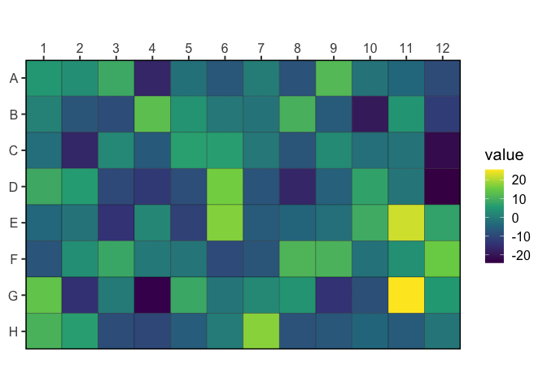

<!-- README.md is generated from README.Rmd. Please edit that file -->

# wellr

<!-- badges: start -->

[](https://lifecycle.r-lib.org/articles/stages.html#experimental)
[](https://CRAN.R-project.org/package=wellr)
[](https://github.com/bradyajohnston/wellr/actions)
[](https://app.codecov.io/gh/bradyajohnston/wellr?branch=master)
[](https://github.com/bradyajohnston/wellr/actions/workflows/R-CMD-check.yaml)
<!-- badges: end -->

`{wellr}` provides a consitent and reliable interface for dealing with
plate-based data and calculations. It provides functions for indexing
through microtitre plates, converting between well IDs (“C05”) and their
respective rows, columns and index. This is a utilitiy package, intended
for use in other packages that deal with plate-based data.

## Installation

<!-- You can install the released version of wellr from [CRAN](https://CRAN.R-project.org) with: -->

You can install from r-universe:

``` r
install.packages("wellr", repos = "bradyajohnston.r-universe.dev")
```

Or you can install the development version from github as below:

``` r
#install.packages("remotes")
remotes::install_github("bradyajohnston/wellr")
```

## Basic Examples

``` r
library(wellr)

well_format("G8")
#> [1] "G08"
well_to_col_num("G8")
#> [1] 8
well_to_row_num("G8")
#> [1] 7
well_to_index("H1")
#> [1] 85
well_to_index("H1", colwise = TRUE)
#> [1] 8
well_from_index(37)
#> [1] "D01"
well_from_index(37, colwise = TRUE)
#> [1] "E05"
well_join(3, 8)
#> [1] "C08"
well_join("E", 10)
#> [1] "E10"
```

## Working with Plates

Create a data frame for plate-based data.

``` r
well_plate(8, 12)
#> # A tibble: 96 × 3
#>      row   col well 
#>    <int> <int> <chr>
#>  1     1     1 A01  
#>  2     1     2 A02  
#>  3     1     3 A03  
#>  4     1     4 A04  
#>  5     1     5 A05  
#>  6     1     6 A06  
#>  7     1     7 A07  
#>  8     1     8 A08  
#>  9     1     9 A09  
#> 10     1    10 A10  
#> # … with 86 more rows
```

## Helpful Plotting Functions

``` r
plate <- well_plate(8, 12)[, "well"]
plate$value <- rnorm(96, sd = 10)

well_plot(plate, well, value)
```


