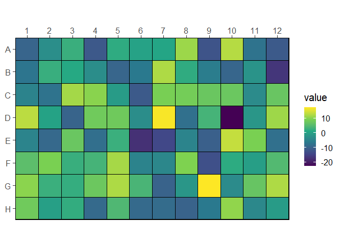

<!-- README.md is generated from README.Rmd. Please edit that file -->

# wellr

<!-- badges: start -->

[](https://CRAN.R-project.org/package=wellr)
[](https://github.com/bradyajohnston/wellr/actions)
[](https://app.codecov.io/gh/bradyajohnston/wellr?branch=master)

<!-- badges: end -->

`{wellr}` provides a consistent and reliable interface for dealing with
plate-based data and related calculations. It provides functions for
reading the output of various plate readers, indexing through and
reformatting microtitre plates, converting between well IDs (“C05”) and
their respective rows, columns and index.

## Installation

<!-- You can install the released version of wellr from [CRAN](https://CRAN.R-project.org) with: -->

You can install from r-universe:

``` r
install.packages("wellr", repos = "bradyajohnston.r-universe.dev")
```

## Basic Examples

``` r
library(wellr)

well_format("G8")
#> [1] "G08"
well_to_col_num("G8")
#> [1] 8
well_to_row_num("G8")
#> [1] 7
well_to_index("H1")
#> [1] 85
well_to_index("H1", colwise = TRUE)
#> [1] 8
well_from_index(37)
#> [1] "D01"
well_from_index(37, colwise = TRUE)
#> [1] "E05"
well_join(3, 8)
#> [1] "C08"
well_join("E", 10)
#> [1] "E10"
```

## Reading Biotek

Get the file paths of the demo files.

``` r
file_data <- system.file('extdata',
                         '20220929_1steptimer20.csv',
                         package = 'wellr')

file_meta <- system.file('extdata',
                         '20220929_1steptimer20_metainfo.csv',
                         package = 'wellr')
```

Read in an example plate from a Biotek plate reader.

``` r
plate <- plate_read_biotek(file_data)
plate
#> # A tibble: 19,200 × 4
#>     time well    lum od600
#>    <dbl> <chr> <dbl> <dbl>
#>  1   521 A01       3 0.09 
#>  2   521 A02      27 0.097
#>  3   521 A03       4 0.091
#>  4   521 A04       3 0.09 
#>  5   521 A05      32 0.096
#>  6   521 A06       3 0.097
#>  7   521 A07      78 0.094
#>  8   521 A08       2 0.095
#>  9   521 A09      20 0.095
#> 10   521 A10     103 0.093
#> # … with 19,190 more rows
#> # ℹ Use `print(n = ...)` to see more rows
```

``` r
plate |> 
  plate_add_meta(file_meta)
#> # A tibble: 19,200 × 8
#>     time well    lum od600 strain  concentration promoter rbs  
#>    <dbl> <chr> <dbl> <dbl> <chr>           <dbl> <chr>    <chr>
#>  1   521 A01       3 0.09  <NA>               NA <NA>     <NA> 
#>  2   521 A02      27 0.097 pRW0041             0 PJ23100  wk2  
#>  3   521 A03       4 0.091 pRW0044             0 PJ23107  wk2  
#>  4   521 A04       3 0.09  pRW0046             0 PJ23109  wk2  
#>  5   521 A05      32 0.096 pRW0047             0 PJ23110  wk2  
#>  6   521 A06       3 0.097 pRW0048             0 PJ23111  wk2  
#>  7   521 A07      78 0.094 pRW0053             0 PJ23100  st8  
#>  8   521 A08       2 0.095 pRW0056             0 PJ23107  st8  
#>  9   521 A09      20 0.095 pRW0058             0 PJ23109  st8  
#> 10   521 A10     103 0.093 pRW0059             0 PJ23110  st8  
#> # … with 19,190 more rows
#> # ℹ Use `print(n = ...)` to see more rows
```

## Creating Dummy Plates

Create a data frame for plate-based data.

``` r
well_plate(8, 12)
#> # A tibble: 96 × 3
#>      row   col well 
#>    <int> <int> <chr>
#>  1     1     1 A01  
#>  2     1     2 A02  
#>  3     1     3 A03  
#>  4     1     4 A04  
#>  5     1     5 A05  
#>  6     1     6 A06  
#>  7     1     7 A07  
#>  8     1     8 A08  
#>  9     1     9 A09  
#> 10     1    10 A10  
#> # … with 86 more rows
#> # ℹ Use `print(n = ...)` to see more rows
```

## Helpful Plotting Functions

``` r
plate <- well_plate(8, 12)[, "well"]
plate$value <- rnorm(96, sd = 10)

well_plot(plate, well, value)
```


